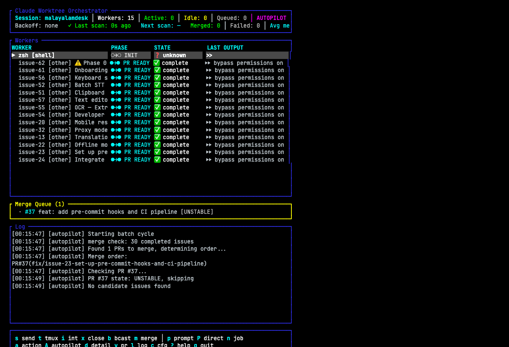

# cwo — Claude Worktree Orchestrator

[](https://github.com/vyshnavsdeepak/claude-worktree-orchestrator/actions/workflows/ci.yml)
[](https://www.rust-lang.org/)
[](LICENSE)
[](https://github.com/vyshnavsdeepak/claude-worktree-orchestrator/commits/main)
[](https://github.com/vyshnavsdeepak/claude-worktree-orchestrator)

A TUI that runs multiple Claude Code workers in parallel across git worktrees. Give it GitHub issues or a task DAG — it creates worktrees, launches Claude in tmux windows, tracks progress, reviews PRs, auto-merges, rebases, and self-heals crashed workers.



## Prerequisites

- [Claude Code CLI](https://docs.anthropic.com/en/docs/claude-code) (`claude`)
- `tmux` / `git` / `gh` (GitHub CLI)
- Rust toolchain (`cargo`)

## Install

```bash
cargo install --path .
```

## Quick Start

```bash
cd your-repo
cwo init              # generates cwo.toml with auto-detected settings
cwo init -i           # interactive — prompts for each value

# Edit cwo.toml: add issues or tasks, then:
cwo
```

## Modes

### Issue Mode (default)

List specific GitHub issues to work on:

```toml
session = "my-workers"
repo = "owner/repo"
repo_root = "/path/to/repo"
issues = [347, 348, 349]
```

CWO fetches each issue, creates a worktree + branch, and launches Claude with the issue spec.

### Task DAG Mode

Define tasks with dependency ordering:

```toml
[[tasks]]
name = "api"
prompt = "Implement the REST API..."

[[tasks]]
name = "frontend"
prompt = "Build the React frontend..."
depends_on = ["api"]
```

Tasks launch automatically when their dependencies complete. Use `:dag status` and `:dag reset` in the TUI.

### Builder Mode

Auto-extract tasks from a GitHub discussion issue:

```toml
run_builder = true
discussion_issue = 1
```

CWO reads the discussion, calls Claude to extract implementable tasks, files GitHub issues, and launches workers — fully autonomous.

### Autopilot Mode

Fully autonomous issue processing — CWO picks open issues, prioritizes them, launches workers, merges PRs, resolves conflicts, and cycles through batches:

```toml
autopilot = true
autopilot_batch_size = 10
autopilot_labels = ["bug", "good first issue"]
autopilot_exclude_labels = ["wontfix", "discussion"]
```

Each cycle: fetch open issues -> analyze with Claude (priority, actionability, file areas) -> select a conflict-minimizing batch -> launch workers -> monitor -> merge PRs -> resolve conflicts via tmux -> repeat. Toggle on/off at runtime with `A`.

The merge queue tracks each PR through its lifecycle (checking, merging, conflict resolution, rebasing) and is visible in the TUI.

## TUI

```
┌─ cwo ─────────────────────────────────────────────────────────────┐
│ Session: my-workers │ Workers: 5 │ Active: 3 │ PRs: 2 │ Merged: 5│
├───────────────────────────────────────────────────────────────────┤
│ WORKER       PIPELINE       STATE         LAST OUTPUT             │
│ ▶ issue-326  ●→○ CODING    active        Analyzing src/main.rs   │
│   issue-327  ●→● PR READY  done          Created pull request #42│
│   issue-328  ●→○ CRASHED   shell         exec claude --dang...   │
│   t-api      ●→○ CODING    active        Writing endpoints...    │
│   t-frontend ○→○ WAITING   waiting on: api                       │
├───────────────────────────────────────────────────────────────────┤
│ j/k nav │ d detail │ s send │ n new │ P direct │ c settings │ ? │
└───────────────────────────────────────────────────────────────────┘
```

### Key Bindings

| Key | Action |
|---|---|
| `j`/`k` | Navigate workers |
| `d`/`Enter` | Detail view (pane scrollback + review notes) |
| `s` | Send message to selected worker's Claude |
| `i` | Interrupt (Ctrl-C) selected worker |
| `b` | Broadcast to all idle workers |
| `n` | Launch worker for a GitHub issue number |
| `P` | Direct prompt — launch worker with raw text |
| `p` | Smart prompt — Claude extracts tasks, files issues |
| `m` | Merge all clean PRs |
| `M` | Merge selected worker's PR |
| `v` | Open PR in browser |
| `t` | Switch to selected worker's tmux window |
| `x` | Close selected worker (kill window + remove worktree) |
| `X` | Close all finished workers |
| `c` | Settings (live config editor) |
| `A` | Toggle autopilot mode |
| `a` | Run custom action on selected worker |
| `l` | Toggle log panel |
| `:` | Command mode |
| `?` | Help |
| `q` | Quit |

### Commands (`:`)

| Command | Description |
|---|---|
| `merge all` | Merge all clean PRs |
| `merge pr 42` | Merge specific PR |
| `rebase all` | Fetch + rebase all workers |
| `broadcast <msg>` | Send to all idle Claude windows |
| `stats` | Session stats (merged, failed, avg time) |
| `dag status` | Show DAG completion state |
| `dag reset` | Reset DAG — re-launch all tasks |

## Configuration

All config in `cwo.toml`. Run `cwo init` to generate one.

### Core

| Field | Default | Description |
|---|---|---|
| `session` | — | Tmux session name |
| `repo` | — | GitHub repo (`owner/name`) |
| `repo_root` | — | Absolute path to git repo |
| `max_concurrent` | `3` | Max simultaneous workers |
| `issues` | `[]` | GitHub issue numbers to launch on startup |
| `claude_flags` | `["--dangerously-skip-permissions"]` | Flags for `claude` CLI |

### Merge & Review

| Field | Default | Description |
|---|---|---|
| `merge_policy` | `"auto"` | `"auto"` / `"review_then_merge"` / `"manual"` |
| `auto_review` | `true` | Spawn AI reviewers for new PRs |
| `review_timeout_secs` | `600` | Merge anyway after timeout (`0` = wait forever) |

### Worker Health

| Field | Default | Description |
|---|---|---|
| `auto_relaunch` | `true` | Relaunch crashed workers |
| `max_relaunch_attempts` | `3` | Give up after N relaunches |
| `stale_timeout_secs` | `300` | Mark stale if no output (`0` = disabled) |

### Autopilot

| Field | Default | Description |
|---|---|---|
| `autopilot` | `false` | Enable autopilot mode |
| `autopilot_batch_size` | `10` | Max issues to analyze per batch |
| `autopilot_batch_delay_secs` | `60` | Delay between batches |
| `autopilot_labels` | `[]` | Only process issues with these labels |
| `autopilot_exclude_labels` | `[]` | Skip issues with these labels |

### Custom Actions

```toml
[[actions]]
name = "Add label"
command = "gh pr edit {pr_num} --repo {repo} --add-label preview"
confirm = true

[[actions]]
name = "Run tests"
command = "cd {worktree} && make test"
confirm = false
```

Variables: `{repo}`, `{issue_num}`, `{pr_num}`, `{branch}`, `{worktree}`, `{window_name}`.

## State & Persistence

Session state is stored per-project at `~/.local/share/cwo/sessions/<hash>/`. This includes runtime config overrides, DAG state, backoff timers, review markers, and command history. Close CWO, reopen later — settings and history persist. Multiple CWO instances on different repos don't collide.

Ephemeral launcher scripts stay in `/tmp`.

## Worker Lifecycle

```
Issue/Task → worktree + branch → Claude in tmux window
    → implements → commits → pushes → opens PR
    → reviewer (if auto_review) → APPROVED / CHANGES_REQUESTED
    → CLEAN → squash merge → delete branch → cleanup
    → BEHIND → rebase + push → merge
    → DIRTY → AI conflict resolver
    → crash → auto-relaunch with git context
```

## Worker States

| State | Meaning |
|---|---|
| `active` | Claude is working |
| `idle` | Claude at prompt, waiting |
| `shell` | Claude exited, bare shell |
| `done` | PR created |
| `stale` | No output change for too long |
| `failed` | Max relaunches exceeded |
| `conflict` | Rebase conflict |
| `queued` | Waiting to launch |
| `waiting` | DAG deps not yet met |
| `probing` | AI probe in split pane |

## Non-TTY Mode

When run without a terminal (e.g. from another Claude instance or CI), CWO automatically re-executes itself inside a tmux session named `cwo`. Attach with `tmux attach -t cwo`.
